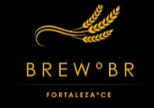

# Intropecção

## Histórico de versão
#

|Data     |Versão|Descrição|Autor(es)|
:--------:|:----:|:-------:|:-------:|
23.06.2021| 0.1  |Início da criação do documento| Victor Nobre
24.06.2021| 0.2  |Adicionando resultado| Victor Nobre
24.06.2021| 0.3  |Formatação  | Victor Nobre
25.06.2021| 0.4  |Revisão | Fernando Martins

## Participantes
#
- Victor Maciel Ventura Nobre

## Resultado
#
Foi realizado uma estimativa de como um usuário do aplicativo se relaciona com as funcionalidades previstas. Com essa estimativa podemos elicitar os seguintes requisitos.

|Número     |Requisito|
|:--------:|:----|
|01| O usuário vai poder fazer o login no aplicativo|
|02| Ao logar teremos imagens de cervejas de anunciantes|
|03| No campo acima dos anunciantes terá um menu e ao lado o nome do usuário
|04| Ao clicar no menu vai aparecer opções do aplicativo
|05| Ao clicar no nome o usuário vai acessar sua conta
|06| O menu será organizado por funções que o usuário deseja no aplicativo
|07| As funcões informadas na aba menu, cervejas, locais, tipos e contato
|08| Ao clicar em cervejas, será direcionado para uma seleção de cervejarias
|09| Ao clicar em países, será direcionado para uma seleção de países
|10| Ao clicar em tipos, será direcionado para uma seleção de tipos de cervejas
|11| Ao clicar em contato, será direcionado para uma caixa de texto
|12| A área da conta o usuário vai poder administrar seus dados cadastrais 
|13| Na área da conta existirá uma aba para o usuário se tornar assinante
|14| Ao clicar em se tornar assinate será oferecido planos de assinatura
|15| Após escolher o plano será direcionado para um API de pagamento.

#

